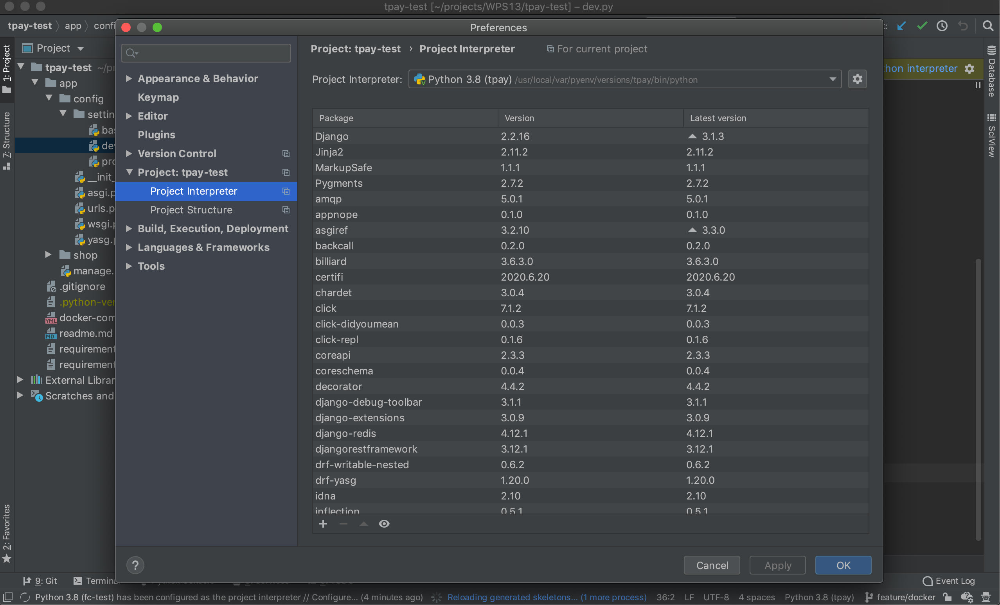
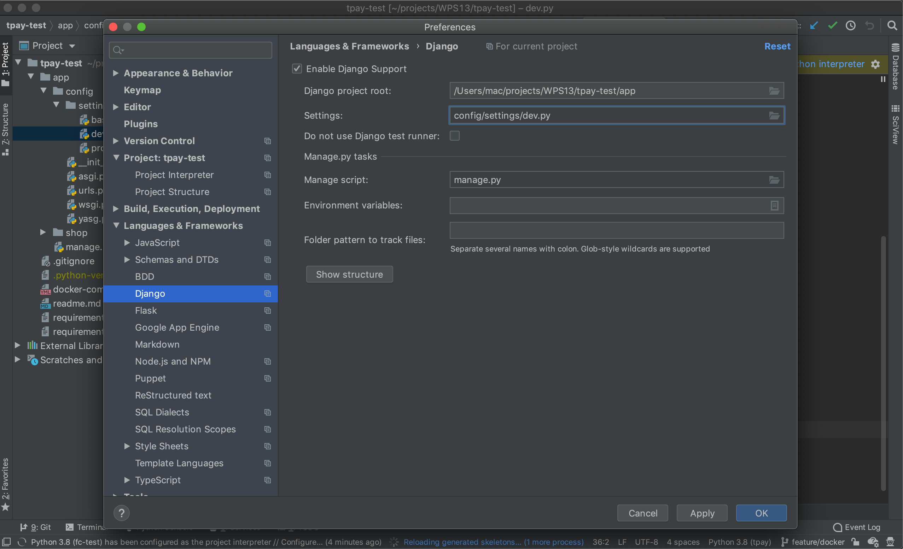
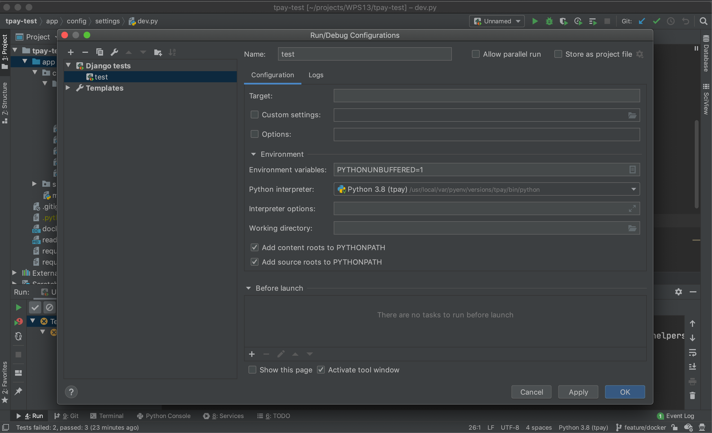
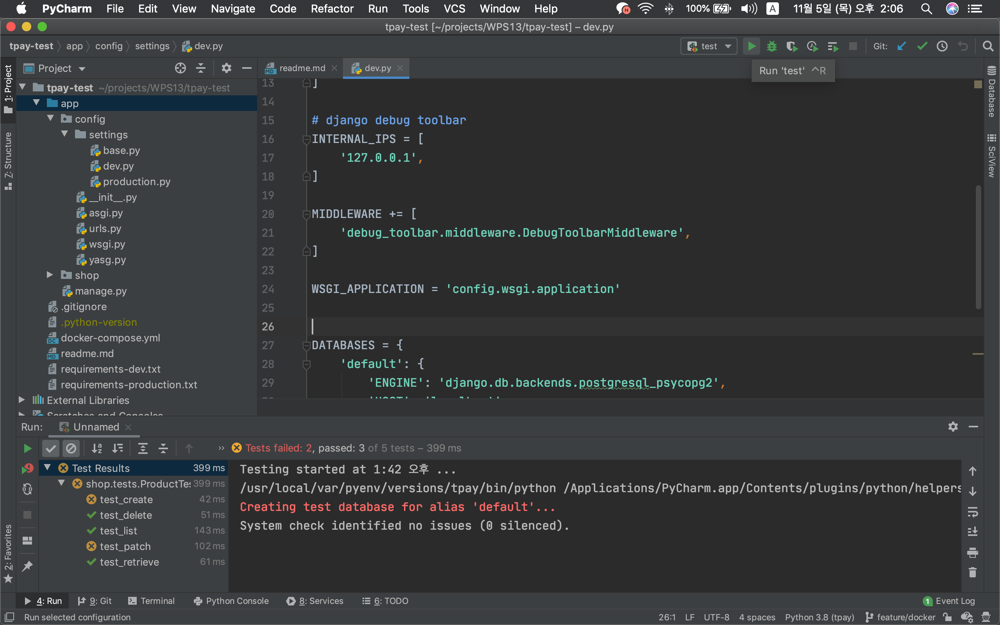

## Requirements
- language
	- Python 3.8.2
- framework
	- Django 2.2.12
	
	
## Setup

```shell script
# git clone git@github.com:jeonyh0924/tpay-test.git
# cd <ROOT DIR>
pyenv virtualenv 3.8.2 <가상환경 이름>
pyenv local <가상환경 이름>

pip install -r requiremens-dev.txt

export DJANGO_SETTINGS_MODULE=config.settings.dev

```

### docker compose 

```shell script
# 기존에 동작하고 있는 docker-compose 가 있다면
#docker-compose down

# 시작 //
# file: <ROOT DIR>/
docker-compose up -d


cd app

./manage.py makemigrations
./manage.py migrate
./manage.py runserver
```

### testcode
1. 파이참 인터프리터 설정.


2. 파이참 프레임워크 설정.


3. run/debug configuration 설정


4. 테스트코드 실행


### API 테스트 방법, PostMan URL

- https://documenter.getpostman.com/view/5847490/TVYQ1Z4s